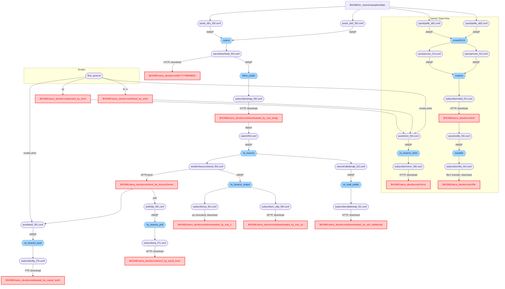
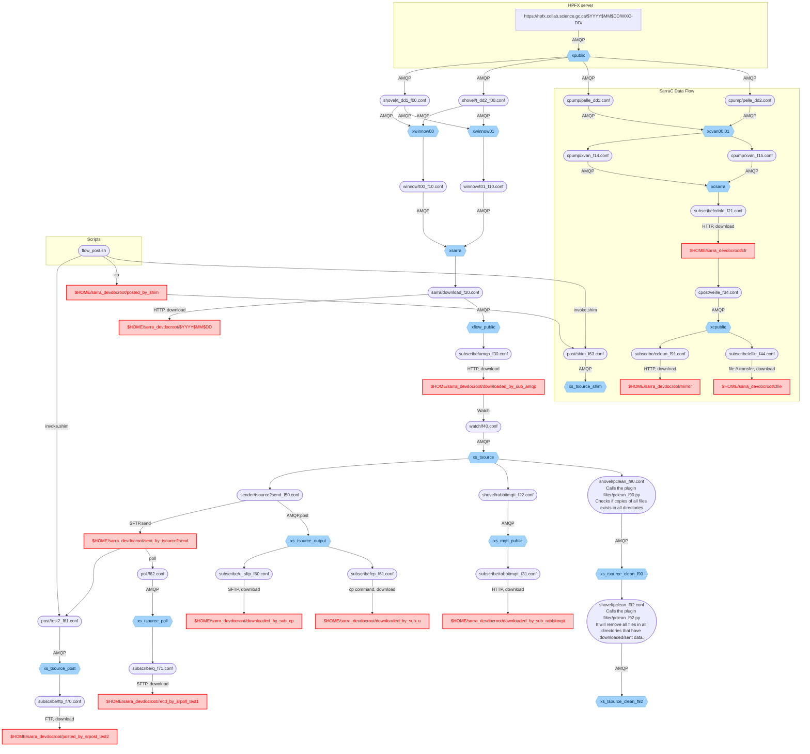

# Flow test graphs

- Dynamic flow test additional documentation/explanation: https://github.com/MetPX/sr_insects/blob/main/dynamic_flow/doc/Explanation.rst

- Legend
    - Boxes highlighted in $\color{red}{\text{red}}$: Directories where data is downloaded/sent locally during the test.
    - Diamonds highlighted in $\color{blue}{\text{blue}}$: Exchanges used on local/public brokers.

## Static flow , Flakey broker , Restart server

NOTE 1: Flakey broker and restart server tests are the same **with the exception of the `subscribe/mirror_f80` configuration being missing**.

## Dynamic flow

NOTE 1: `flowcb/filter/pclean_f90.py` and `flowcb/filter/pclean_f92.py` plugins call `flowcb/pclean.py` which inherently looks at all the directories that download/send data. These plugins are all included in the sr3 source code.

